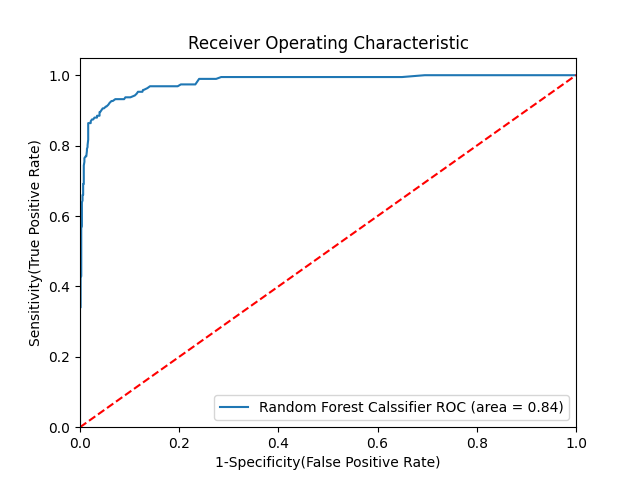

# Holiday Package Purchase Prediction

This repository contains a notebook that demonstrates how to use a Random Forest classifier to predict whether a customer will purchase a travel package. The data is provided in **Travel.csv**, which includes demographic and behavioral information such as age, occupation, contact type and previous trips. The target label is **`ProdTaken`**, indicating if the customer bought the product.



## Project Contents

- `Travel.csv` - dataset with 4,888 rows and 20 columns.
- `random-forest-classification-implementation.ipynb` - Jupyter notebook containing preprocessing, feature engineering and model training steps.
- `auc.png` - ROC curve for the Random Forest model.

## Usage

1. Install the dependencies listed below (Python 3.7+). A simple way is via `pip`:

```bash
pip install pandas numpy scikit-learn matplotlib seaborn
```

2. Open the notebook and run all cells to reproduce the results. The notebook loads the CSV, fills missing values, creates a `TotalVisiting` feature and then trains several classifiers. Model evaluation metrics such as accuracy, F1 score and ROC AUC will be printed.

## Results

The Random Forest model obtained an accuracy of about **0.93** on the test set and outperformed Logistic Regression, Decision Tree and Gradient Boost models in this notebook. See the notebook for the full comparison.

## Dependencies

- Python 3.7 or higher
- pandas
- numpy
- scikit-learn
- matplotlib
- seaborn

